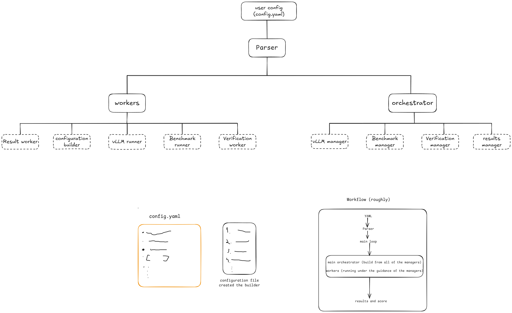

# vTune Architecture

## Early design sketch

The following sketch captures the original architecture idea: configuration is
parsed once, managers coordinate the workflow, and focused workers execute the
vLLM, benchmark, verification, and result operations.

This is preserved as an early concept sketch. It established the project's
manager-and-worker direction, while the refined diagram makes component
ownership, the `TrialManager` pipeline, retries, parallel trials, adapters, and
result flow more explicit.

## Refined architecture diagram

The current editable diagram is available as
[vtune-architecture.drawio](vtune-architecture.drawio). It can be opened with
[diagrams.net](https://app.diagrams.net/) or a compatible Draw.io editor.

## Agreed ownership model

- The parser and validator produce one typed, resolved configuration.
- The application builder constructs the selected managers, workers, and
  external adapters.
- The main run orchestrator owns the run loop and retry decisions.
- The search manager suggests configurations and records outcomes.
- The trial scheduler starts one `TrialManager` in the MVP and may start several
  concurrently later.
- Each `TrialManager` owns one trial attempt and coordinates its configuration,
  vLLM, readiness, benchmark, verification, and result workers.
- Workers perform focused operations and return `completed`, `failed`, or
  `interrupted`; they do not decide retry policy.
- External tools remain behind adapters so implementations can be replaced.
- The results manager is the single path for persistence, scoring, ranking,
  comparison, and reporting.

Every invocation creates a new immutable run. Automatic retry creates another
attempt inside the active run; manual retry creates a linked validation run.
